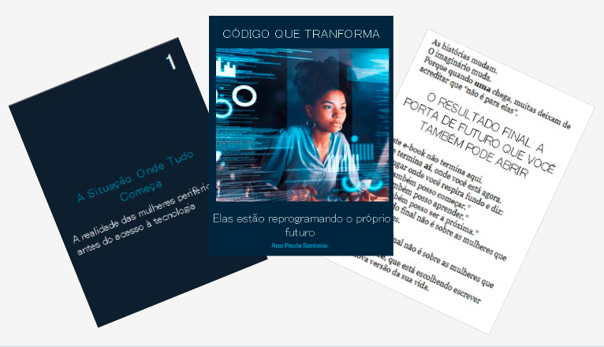

    

-------

 

# 📚 Projeto EBOOK — Criado com IA, vivido por Ana Paula Santana

 > ℹ️ **NOTE:** Este repositório reúne o material desenvolvido durante minha jornada de estudos em IA Generativa na plataforma [DIO](https://dio.me)

Este projeto teve como objetivo criar um e-book inspirador utilizando ferramentas de Inteligência Artificial para construção do conteúdo, enquanto a diagramação, sensibilidade e curadoria foram conduzidas por mim, Ana Paula Santana.
O e-book conta histórias emocionantes sobre mulheres da periferia que transformam a tecnologia em caminho, coragem e futuro.

<a href="https://github.com/anapaula-sds/prompts-recipe-to-create-a-ebook" title="View PDF now"> 📕Clique aqui para ler</a>

## 💻 Tecnologias utilizadas no projeto

- [ChatGPT](https://chat.openai.com/) 
- [Microsoft Design](https://designer.microsoft.com/)
- [PowerPoint](https://www.microsoft.com/en/microsoft-365/powerpoint)

## 🧠 Prompts

ChatGPT：

|   Ação   | prompt                                                                                                                                                                                                                                                                         |
| :------: | ------------------------------------------------------------------------------------------------------------------------------------------------------------------------------------------------------------------------------------------------------------------------------ |
|  título  | Crie sugestões de título para um e-book inspirador sobre a jornada de mulheres da periferia entrando na tecnologia, usando uma narrativa emocional, motivacional e humana. Liste 5 variações.                                                        |
| conteúdo | Crie um e-book estruturado no método STAR sobre mulheres da periferia que enfrentam barreiras sociais para entrar na tecnologia. Mantenha o tom poético, inspirador e socialmente consciente. Inclua exemplos reais, desafios, contexto e histórias inspiradas em trajetórias de superação. |

Microsoft Designer：

|  Ação  | prompt                                                                                 |
| :----: | -------------------------------------------------------------------------------------- |
| Imagem | Crie uma arte realista e futurista retratando mulheres negras na tecnologia, destacando inteligência artificial, circuitos luminosos, elementos de dados e atmosfera de inovação. A estética deve ser moderna, inspiradora e representativa, com foco em força, ancestralidade, tecnologia e futuro. Geração em estilo digital-art, alta resolução. |

## ✨ Features

- Conteúdo gerado via ChatGPT
- Imagens geradas via Microsoft Design

## 📚 Materiais

- Imagens utilizadas em `assets`
- ebook gerado durante as aulas em `output`

## 🛠️ Instruções de execução

Utilize os prompts acima nas ferramentas sugeridas para gerar o material base e utilize uma ferramenta de edição de documentos como power point, libreoffice , indesign para diagramação.

## 👨‍💻 Expert

    
    
&nbsp&nbsp&nbsp Ana Paula 
    &nbsp&nbsp&nbsp
    <a href="https://github.com/anapaula-sds">
    GitHub</a>&nbsp;|&nbsp;
    <a href="www.linkedin.com/in/anapaula-sds">LinkedIn</a>
&nbsp;|&nbsp;

  

---

⌨️ com 💜 por [Ana Paula Santana](https://github.com/anapaula-ss)
